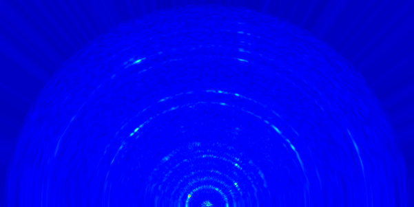
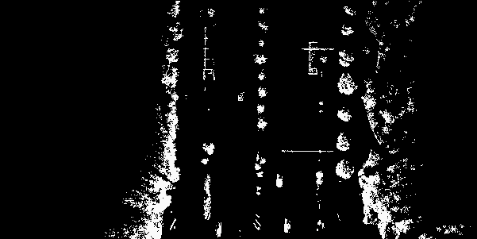

### RadarRF-LiDARBev
This work is aiming to achieve the Alignment between Radar RF image and LiDAR Bev image

- In folder 'demo': generate RF image from mmWave ADC data.
- In 'main.py': radar polar RF image to cartesian image.

Ref: OxfordRadarCarDataset SDK
